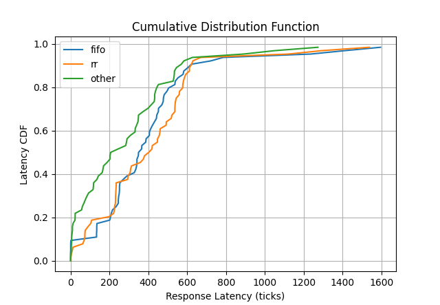

# Lab 3 -- Scheduling and Threading

The purpose of this lab is to introduce you to the concepts of
scheduling and concurrency.  This lab consists primarily of two parts:  First,
you will be extending xv6's scheduler to support multiple new schedulers.
Second, you will be constructing a kernel-space threading library. 
This lab also includes an extra-credit opportunity that allows you to design your 
own scheduling algorithm and benchmark its performance.

This is a *large* lab, larger than the labs you've done so far, so be warned! 

To help you stay organized, we have split it into two main checkpoints:
- Lab 3 - Checkpoint (Part 1)
- Lab 3 (Full lab)

To give a sense of how long it may take to complete each part, we've marked
them with the following labels:
- easy: 30m to 1hr
- moderate: 1-5hrs
- hard: 5-9hrs

Note that there are just estimates. Your completion time will vary based on
your grasp of the course material and proficiency with navigating xv6. We
highly recommend that you read chapters 3 to 5 of the xv6 manual.

**NOTE:** Throughout this lab, you will have to test the concurrency of your
system.  You will have to run the `xv6-qemu` script with multiple cpus (default
is 1 cpu) using the `-c <CPUS>` or `--num-cpus=<CPUS>` flags.  We recommend
initial debugging with 1 cpu, to make things easier to parse, then further
debugging with additional cpus.

```
// Make sure you see the following lines of code
// when running ./xv6-qemu -c 4 for example
cpu1: starting 1
cpu2: starting 2
cpu3: starting 3
cpu0: starting 0
```

## Part 1 (moderate) -- Scheduling

In this portion of the lab we will define a basic scheduler API, and build several new
schedulers.

#### Background
Recall the xv6 scheduler is found in `kernel/src/proc.c`, in the `scheduler()` function, and by
default implements a round robin (RR) scheduler. After each CPU is setup, all
eventually reach `mpmain()`, where `scheduler()` is called for the first time.
`scheduler()` loops over the process table in order looking for `RUNNABLE`
processes. When a `RUNNABLE` process is found, the kernel switches to that
process. It executes until it finishes or until a timer tick interrupts it and
causes the process to `yield()`.

Remember that the timer is a hardware interrupt. The code for handling this is
found in `kernel/src/trap.c`, around line 105.

```
// Force process to give up CPU on clock tick.
// If interrupts were on while locks held, would need to check nlock.
if (proc && proc->state == RUNNING && tf->trapno == T_IRQ0+IRQ_TIMER)
  yield();
```

`yield()` sets the current process to `RUNNABLE` and then switches directly to the
kernel scheduler.

### The Spec

For this portion of the lab, you will be enabling the user-space to specify
their scheduler policy.  You will:

- Enable the user-space to select their scheduling policy (`SCHED_RR`, or
  `SCHED_FIFO`)
- Enable the user-space process to set a priority.
- Implement two new schedulers: Round Robin with Priority and FIFO with Priority


#### Added System Call

To enable the user-space to set their scheduler policy, you will be adding one
system-call to the kernel:

```
int setscheduler(int pid, int policy, int priority);

Arguments:
pid - the pid of the process to change priority (a process may only change the
scheduler of themselves, or their direct children)
policy - the scheduler policy (SCHED_RR, SCHED_FIFO)
priority - the priority value to be set (any non-negative int value is
legal)

setscheduler should be declared in a program by including "user.h" and
should be defined within the user-space ulib library (ulib_SOURCES
in user/Sources.cmake).
```

A user-space program should also be able to use the macros `SCHED_RR` and
`SCHED_FIFO` by including the file `include/sched.h` (typically through the
pre-processor directive `#include "sched.h"`).

#### Scheduling Algorithms

You will be building two schedulers for this lab, a Round Robin (RR), and a
First In First Out (FIFO) scheduler.  We will also be adding a notion of
priority to these schedulers.  We will explain the behaviors of these
schedulers without priority first, then add the notion of priority after.

##### Round Robin

Your Round Robin scheduler will logically create a circular buffer of processes
to run, and loops over the buffer.  It will run each process in the buffer for
either one scheduling quantum (unit of scheduling), or until the process becomes
non-runnable.  At which point it will select the next process in the circular
buffer.

For this lab you are to implement a round robin scheduler, much like the default
xv6 scheduler (note the default xv6 scheduler is a reasonable RR baseline, and you
may directly use that code, particularly for your non-priority scheduler).  Your
scheduler must:  Keep circular buffer of processes, then run those processes in order
assigning a time-quantum to each process.  Once that time quantum has expired, the
scheduler should run the next available process.

##### First-In-First-Out

The second scheduler you are to construct is the First-In-First-Out (FIFO) scheduler.
The FIFO scheduler logically keeps a list of processes, then runs them in-order.  Unlike
the RR scheduler, as long as the process at the head of the FIFO queue can make process,
it will not be preempted unless a higher priority process comes along (see the priorities
section).

There are two major  differences, between RR and FIFO.  1) FIFO will not yield to another
process of the same priority until the current process becomes un-runnable.  2) FIFO processes will
always run with higher priority than RR processes (e.g. if there are any
runnable FIFO processes, they should run before any RR processes).

##### Priorities

Now that we've specified the basics of FIFO and RR scheduling, we'll specify
our priority policy.

Each process has both a scheduler policy and priority.  When each of your
schedulers are selecting a process, the scheduler should obey the following
rules:

- FIFO policy processes always run before RR policy processes.
- Higher priority values correspond to higher logical priority.
- A process will not be scheduled if a higher priority process is runnable.  
- If two processes share priority, then they will run in scheduler order
  (as specified in the scheduler specification).
- When a new process becomes runnable, if it should run before the current
  process, your scheduler should immediately preempt the currently running process and
  schedule it (with one exception, in "Nit").


##### Nit:
Do not temper with the APIC `TIMER` or `PERIODIC` as you will be modifying the 
external timer which interrupts the CPU for scheduling decisions.

If another process becomes a better candidate than the currently running process
the kernel must immediately switch to running that process.

There is one exception to this rule. If there are multiple CPUs active, and an
action on CPU ` c1` running process `p1`causes a process to become
RUNNABLE that is not higher priority than `p1`, but is higher priority than
process `p2` currently running on a different CPU `c2`, then `c2` need not
preempt `p2` until the first of: an interrupt to `c2`, `p2`'s completion, or an
event which causes `p2` to suspend.

#### Default Behavior

All processes should default to `SCHED_RR` with a priority of 0

## Part 1 Extra Credit (moderate) -- Custom Scheduling Algorithm and Evaluation 

If you have successfully implemented FIFO and RR, this is an opertunity to design your
own scheduling algorithm, and evaluate its performance with respect to the prior algorithms. 

##### Custom Scheduling Algorithm

This is the open-ended design portion of the assignment. Feel free to implement any scheduling algorithm, 
which you have studied in class, or which you have done your own research on. 
Below are a few suggestions of potential algorithms you may want to consider:
- Linux Completely Fair Scheduler
- Multilevel Queue Scheduling
- Multi-Queue Multiprocessor Scheduing (Per-processor Queue)
- Cache Affinity Scheduling

##### Gathering Statistics

In order to evaluate the performance of your scheduling algorithm, you will need to 
implement a mechanism for gathering scheduling statistics.
For the purpose of measuring timing, take a look at `allocproc()`, `sleep()`, `yield()`, and `schedule()`, 
all of which are boundries which you may need to measure a given statistic. 

You must implement all of these measurements, though you may add intermediary values as necessary in 
order to properly calculate these statistics. 

The unit of measurement that you must use for these statistics is xv6 `ticks`. This is a global
counter in the kernel that is incremented for every time-quantum that has passed. 

```
/* include/sched.h */
struct schedinfo 
{
  uint creation_time;  // ticks when the process was created
  uint exit_time;      // ticks when the process exited
  uint response_time;  // ticks from creation to exit (user-centric measure)
  uint execution_time; // ticks spent executing on a cpu
  uint wait_time;      // ticks spent waiting in ready queue
  uint io_time;        // ticks spent waiting for and executing in I/O 
};
```

In order to retrieve these statistics from user-space, you will need to implement
a specialized wait system-call that will take in a pointer a user `schedinfo struct`, and will 
fill these information when the process exists.

```
int waitinfo(struct schedinfo *info)

Arguments:
  info -- pointer to a struct schedinfo that will be filled in with the correspoinding processes statistics

Return:
  -1 on error, pid on success

Behavior:
  Same behavior as wait with additional performance measurement features

```

##### Performance Evaluation

Now that you have implemented your own scheduler, you will need to evaluate its performance compared to 
Round-Robin and FCFS. We have provided a benchmark that you are able to run in order to gather your data `workload`. 

_Once you have `setscheduler` and `waitinfo` implemented, make sure to update the `workload.c` file to utilize these functions by uncommenting the respective code._

As discussed in class, a method for evaluating the performance of schedulers is to plot the 
cumulative distribution of end-to-end latency (creation -> exit response time). Plot the latency
on a cdf curve and note the P50, P95 and P99 scores. Feel free to draw additional graphs to represent your data
in a visualizable format, in addition to your latency cdf.

Below is an example of a cdf that was gathered of FCFS, Round-Robin and an additonal improved scheduler running the xv6 workload on 4 CPUs:



A note on the statistics gathered, since we are running xv6 on top of an emulator
such as qemu rather than on bare-metal, results may strongly vary depending on
host device and the performance capabilities of the emulator. 

##### Technical Writeup 

As you have the freedom to implement any scheduling algorithm, you must explain your 
design decisions and present your performance measurements. You must submit a ~1 page writeup detailing the implementation
of you scheduling algorithm, and analysing the performance results that were gathered. Include any relevant graphs
and table that will be useful in your writeup. Please name the file `report.pdf` and place it in the project root
(double-check your `submission.zip` to ensure it is included when you submit).

## Part 2 (hard) -- Threading

What is a thread, and how do we build it?  Like a process, a thread represents
an independent execution context (all processes execute independently), however,
where processes have memory isolation, a thread shares its address space with
all of its peer threads.

In this part of lab3 you will be adding threading support to xv6.  Like Linux,
you'll be treating threads as processes, however they share memory with their
neighboring threads.

### The birth of `clone`

First, you'll need a way to create a new thread (a process that shares address
space with its parent).  For this lab, we'll be accomplishing this with our
version of the classic system call `clone()`:

```
int clone(void *stack, int stack_size)

Arguments:
  stack -- a pointer to the beginning of a memory region of size stack_size, to
           be used as the new thread's stack
  stack_size -- the size of the new thread's stack in bytes

Return:
  As with fork, clone returns twice on success (in the child and the parent).
  The returned values are:
    Parent - the pid of the child.
    Child - 0

  On error clone returns exactly once, with the value -1 (no child is created).

Behavior:
  On success clone creates a new process which shares its address space with its
  parent.  Additionally, clone sets up the child's stack to be logically
  equivalent to the parent's stack.  On clone the child's register state is
  equivalent to that of the parent, with the exception of registers used for 
  the return value from clone (recall eax is the return value of a system call), 
  or holding information about the stack.
```

`clone()` creates a new process, and adds it to the caller's "thread group".
Processes within a "thread group" all share the same address space.  Thread
groups are created via either the `fork` or `exec` system calls.  The first
process within a thread group (the `fork`d or `exec`d process) is the thread
group's owner.  If the owner of a thread group terminates before the other
threads in the group, the behavior for those threads is undefined.

Clone should additionally follow these rules:

- Clone should fail cleanly on errors. If clone cannot run (for instance, if its
  passed a stack that's too small), it should return with an error.

- Cloned processes share several resources with their parent, namely:
   - Virtual address space (shared memory)
   - File descriptor table
   - Current working directory

When any thread makes a change to a shared resource (such as writing to memory,
allocating new memory, or changing the directory) that change should be visible
to all threads in that thread group. 

**NOTE:** Clone sets up its stack to be logically equivalent to its parents, however it
cannot just `memcpy` the stack.  What do you know about stacks that limits you
from doing this (think back to lab1's backtrace)?  How must clone adjust?

### Waiting on specific processes

xv6 has a `wait` system call that waits on any child process. This is useful
when we don't know which children we want to wait on, but can result in
non-deterministic results. As you will see below, we sometimes need to be able
to wait on specific processes.

You will add support for this by implementing the `waitpid()` system call:
```
int waitpid(int pid)

Arguments:
  pid -- pid of the process/thread to wait on

Return:
  -1 on error, 0 on success

Behavior:
  Wait on the process/thread with process id = pid. If the pid doesn't exist
  you must return -1 without waiting.
```

### Nits

- All threads within a thread group share all shared resources.
- If a thread finishes before its children, the behavior of those children
  (threads spawned by this thread) is undefined.

## Part 3 (moderate) -- Beginnings of a userspace threading library

We now have sufficient support from the kernel to start building a userspace
threading library.

You will now implement the following userspace library functions to allow users
to easily create and wait on threads. These functions are defined in
`user/src/threads.c`.
```
Function: thread_create
Arguments:
  - start_routine -- A function pointer to the routine that the child thread will run
  - arg -- the argument passed to start_routine
Return Value:
  - -1 on failure, pid of the created thread on success
Description:
Creates a new child thread.  That thread will immediately begin running start_routine,
as though invoked with start_routine(arg).

Definition:
int thread_create(void *(*start_routine)(void *), void *arg);


Function: thread_wait
Arguments:
  - pid -- pid of the thread to wait on
Return Value:
  - -1 on failure, pid of the joined thread on success
Description:
Waits for a child thread of process id = pid to finish.

Definition:
int thread_wait(int pid);
```

These functions are declared in `user/include/threads.h`. You will implement
them in `user/include/threads.c`. Be warned, despite this simple interface,
these functions actually have tricky implementations, particularly when
attempting to safely avoid memory leaks.

**Important: Lab3's thread library has some rather tricky behavior related to
deallocating its stack. We provide you with a small assembly segment which
atomically calls "free" of the stack of currently running thread, then calls
exit safely. You may use this code in your project. (To use
`free_stack_and_exit`, include the header "free_stack_and_exit.h". The source
code for it can be found in `user/asm/free_stack_and_exit.S`)**

### Nits

- Since `thread_wait` takes in a pid, users can pass in the pid of the process
  itself (and not that of a thread created by it). This is fine.

## Part 4 (easy) -- Userspace spinlocks

Now you will extend your userspace library by implementing spinlocks.

You will implement the following functions:
```
Function: spinlock_init
Arguments:
  - s -- a pointer to the spinlock to initialize
Return value:
  - -1 on failure, 0 on success
Description:
Initializes a spinlock.

Definition:
int spinlock_init(struct spinlock *s);


Function: spinlock_acquire
Arguments:
  - s -- a pointer to the spinlock to acquire
Return value:
  - -1 on failure, 0 on success
Description:
Acquires a spinlock. If the spinlock is already locked, the calling thread spin
until the lock is available.

Definition:
int spinlock_acquire(struct spinlock *s);


Function: spinlock_release 
Arguments:
  - s -- a pointer to the spinlock to release
Return value:
  - -1 on failure, 0 on success
Description:
Releases a spinlock.

Definition:
int spinlock_release(struct spinlock *s);
```

These functions are declared in `user/include/threads.h`. You will implement
them in `user/include/threads.c`. As discussed in class, implementing
synchronization primitives is tricky. In particular, you will need to use
atomic instructions to avoid data races. To that end, we've patched C11 atomics
to the userspace implementation of xv6. You can find the corresponding header
file at `user/include/atomics.h` (which you can subsequently include using
`#include "atomics.h"` in userspace). 

## Part 5 (hard) -- Userspace mutexes

With spinlocks you can now write multi-threaded code that protects its critical
sections.  Spinlocks, however, can be inefficient if the lock is heavily
contended because you waste CPU cycles by having multiple threads contending
for the lock spin in a loop.

Instead of spinning we can put the process to sleep if the lock has been
acquired by some other process and wake it up when released. Locks that exhibit
this behavior are commonly referred to as mutexes.

For this part we will be implementing a userspace mutex. Implementing a mutex
in userspace is tricky due to the "lost wakeup" problem in which a process is
notified to wakeup right before it goes to sleep, thereby losing the
notification and sleeping indefinitely.

To address this issue, we will be implementing the following system calls:
```
Function: park
Arguments:
  - chan -- The channel to sleep on
Return value:
  - -1 on failure, 0 on success
Description:
Puts a process to sleep on channel chan

Definition:
int park(void *chan);


Function: setpark
Arguments:
  - chan -- The channel to sleep on
Return value:
 - -1 on failure, 0 on success
Description:
Signals that a process intends to sleep. It doesn't put the process to sleep
however.

Definition:
int setpark(void *chan);


Function: unpark
Arguments:
  - chan -- The channel to sleep on
Return value:
 - -1 on failure, number of processes woken up on success
Description:
Wake up at most one process sleeping on channel chan.

Definition:
int unpark(void *chan);
```

Once you have these system calls in place, use them to implement the following
functions in `user/src/threads.c`:
```
Function: mutex_init
Arguments:
  - m -- a pointer to the mutex to initialize
Return value:
  - -1 on failure, 0 on success
Description:
Initializes a mutex.

Definition:
int mutex_init(struct mutex *m);


Function: mutex_acquire
Arguments:
  - m -- a pointer to the mutex to acquire
Return value:
  - -1 on failure, 0 on success
Description:
Acquires a mutex. If the mutex is already locked, the calling thread will
sleep until the mutex is available.


Definition:
int mutex_acquire(struct mutex *m);

Function: mutex_release
Arguments:
  - m -- a pointer to the mutex to release
Return value:
  - -1 on failure, 0 on success
Description:
Releases a mutex. If there are any threads waiting on the mutex, one of them
will be woken up

Definition:
int mutex_release(struct mutex *m);
```

### Nits

- `setpark(void *chan)` doesn't put the process to sleep. It only informs the
  kernel that the process is _about to go to sleep_ in the near future. You
  will need this to solve the "lost wakeup" problem. Additionally, there is no
  guarantee that setpark is called, it could happen that a used does not decide
  to use setpark and rather just uses park and unpark, meaning that you must not
  rely on setpark being called.
- `unpark(void *chan)` doesn't specify which process to wake up. We leave this
  choice to you.

## Part 6 (easy) -- Userspace conditional variables

While spinlock and mutex synchronization work well, sometimes we need a
synchronization pattern similar to a producer-consumer queue. Instead of
spinning on a spinlock or yielding the CPU in a mutex, we would like the thread
to sleep until certain condition is met. Condition variables give us this
abstraction.

Implement the following functions in `user/src/threads.c`:
```
Function: cond_init 
Arguments:
  - cond -- a pointer to the condition variable to initialize
Return value:
  - -1 on failure, 0 on success
Description:
Initializes a condition variable.

Definition:
int cond_init(struct condvar *cond);


Function: cond_wait 
Arguments:
  - cond -- a pointer to the condition variable to wait on
  - m -- a pointer to the mutex to acquire
Return value:
  - -1 on failure, 0 on success
Description:
Atomically blocks the current thread waiting on the condition variable cond,
and releases the mutex m. The waiting thread unblocks only after another thread
calls cond_signal. After being woken up the current thread reacquires the mutex
m.


Definition:
int cond_wait(struct condvar *cond, struct mutex *m);


Function: cond_signal
Arguments:
  - cond -- a pointer to the condition variable to signal
Return value:
  - -1 on failure, 0 on success
Description:
Unblocks one thread waiting for the condition variable cond.

Definition:
int cond_signal(struct condvar *cond);
```

## General Guidance

Recall, a kernel's responsibility is to provide high-level abstractions to the
user-space. Any user-behavior shouldn't be able to break the abstractions
provided by the kernel. As such, user-state and user input to the kernel should
not allow the user-space to execute arbitrary code on the user's behalf, modify
arbitrary kernel memory, or crash the kernel. The autograder will try to crash
your kernel by providing unexpected user-space input! You should protect against
bad input that comes from user-space, just as a real kernel must protect against
malicious users.

Also, the kernel persists throughout the lifetime of the machine. As a result,
any OS code should be free of memory leaks and data-races. Your code should
error out correctly when given bad inputs, and shouldn't leak resources (memory,
process table entries, or fds, etc), even in the instance of failures.

Lastly, we encourage you to have fun while implementing it. It may seem daunting
at first, but know full-well that you have all that you need to do well in this
lab. Make good use of lectures, Piazza, and office hours: we're there to help.

## Autograder

As usual, you will submit this lab to the autograder. The testcases are shown below:

- Scheduling Tests
  - Test 1-10
- Clone Functionality
  - Tests 10-15
- Clone error / security
  - Tests 16-21
- Thread library general testing
  - Tests 22-26
- Thread library error / security testing
  - Tests 27-31
- Spinlock
  - Test 32
- Park, setpark, unpark
  - Tests 33-35
- Mutex
  - Test 36
- Waitpid
  - Test 37
- Condvar
  - Tests 38-41

**IMPORTANT**: Since this lab has a good deal of concurrency involved, you may
be able to pass some tests without correctly implementing some of these
primitives. We will be looking over your submission when hand-grading, so
please thoroughly test your implementation.

On Gradescope you will find two assignments:
- Lab 3 - Checkpoint
- Lab 3

Your final Lab 3 score is equal to the score you get for the Lab 3 assignment (autograded + hand-graded). 
This means that you can continue working on the checkpoint tests after the due date. If you are able to pass 
all the autograder tests in the checkpoint by the due date, **five bonus points** will be added to your final Lab 3 score.

## Hand Grading
Similar to lab 2, there is a hand graded section of the lab. We will check for
the following:
- Mutal exclusion in newly created kernel data structures
- Attempts to subvert the autograder
- Violations of the student honor code
